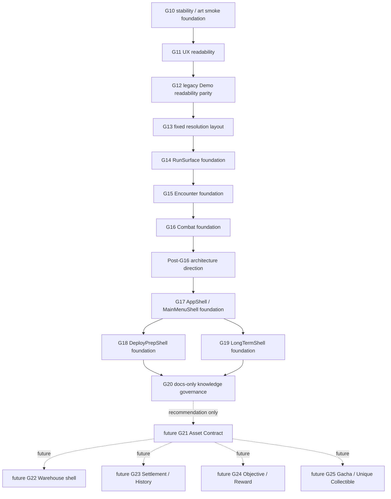

# 阶段依赖图

## 依赖图

## 阶段依赖

| 阶段 | 依赖前置结构 | foundation 状态 | 需要后续补全 | 不能直接扩展为什么 |
| --- | --- | --- | --- | --- |
| G10 | G9 UI core flow | 是，稳定化/art smoke foundation | runtime/manual smoke、真实美术、完整 progress | 完整 MetaProgress、Deploy persistence、长期系统 |
| G11 | G10 稳定化与手测路径 | 否，窄口径 readability repair | 后续旧 Demo feel、布局与 surface | 完整 UI polish 或 complete settings |
| G12 | G11 可读性与手测文档 | 否，旧 Demo feel/readability 对齐 | 固定分辨率和 visible surface | 旧 Demo 1:1 remake |
| G13 | G12 文案/feedback 基线 | 是，fixed-tier layout foundation | runtime/manual verification、更多平台支持 | 任意宽高比/mobile/4K 全面支持 |
| G14 | G13 固定布局 | 是，RunSurface display foundation | EncounterSlot、更多 surface polish、runtime smoke | 规则所有者或完整 run screen |
| G15 | G14 RunSurface | 是，Encounter foundation | 更多 encounter types、combat bridge | 完整遭遇系统、lottery、out-of-run progression |
| G16 | G15 Encounter contract | 是，Combat foundation | Boss/elite/skills/animation 等战斗扩展 | 完整战斗系统或 gameplay runtime PASS |
| G17 | Post-G16 direction、G15/G16 foundation | 是，AppShell/MainMenuShell foundation | DeployPrep、LongTerm、settings/full app features | 完整主菜单功能总成或直接 RunScene 启动 |
| G18 | G17 AppShell | 是，DeployPrepShell foundation | Asset Contract、Warehouse、RunStart handoff | 真实出发探索、真实仓库、Deploy persistence |
| G19 | G17 AppShell | 是，LongTermShell foundation | Asset Contract、Settlement/History、Reward、Gacha | 真实长期系统、MetaProgress、资产系统 |
| G20 | G18/G19 之后的知识密度 | docs-only，不是 gameplay foundation | R3d inventory/matrices；后续 G21+ 独立计划 | Asset Contract、Warehouse、gameplay |

## 不能直接扩展为真实系统的阶段

- G15 不能直接扩展成完整遭遇系统；它只提供 public contract 与 UI adapter。
- G16 不能直接扩展成完整战斗系统；它只提供 Monster `attack_basic` foundation。
- G17 不能直接扩展成完整主菜单总成；它只确立 top-level route ownership。
- G18 不能直接扩展成真实出发探索；它不启动 RunScene，不读写真实 run/warehouse 状态。
- G19 不能直接扩展成真实长期系统；它不实现 asset、reward、history、gacha、persistence 或 MetaProgress。
- G20 不能直接扩展成 Asset Contract；G20 是 docs-only knowledge governance。

## G20 明确边界

G20 只做文档治理：design source 文本入库、project governance、stage summaries、route analysis、system boundary map、stage dependency map 和导航文档校准。G20 不实现 Asset Contract、Warehouse、Settlement、Objective、Gacha 或 gameplay，不运行 Godot。

## 后续补全顺序建议

1. R3d 完成完整库存和矩阵登记。
2. G21 先做 Asset Contract Foundation。
3. G22 再做 Warehouse / Asset Page Shell Foundation。
4. G23 做 Settlement / History Snapshot Foundation。
5. G24 做 Objective / Reward Event Contract。
6. G25 做 Gacha / Unique Collectible Preview Foundation。

这些阶段均未启动，必须独立授权。
