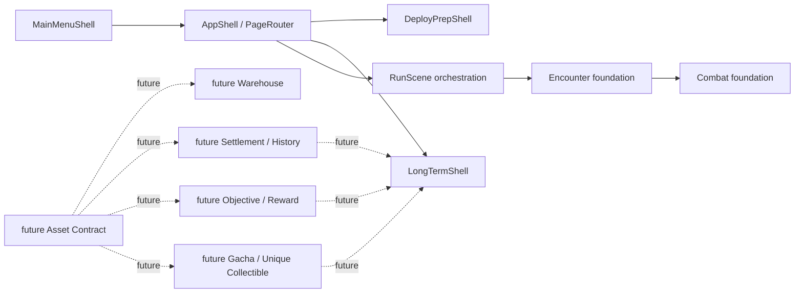

# 系统边界图

## 边界图

## AppShell

- 负责什么：top-level route ownership、PageRouter 调度、承接 MainMenuShell/DeployPrepShell/LongTermShell/run route。
- 不负责什么：run rules、combat、warehouse、long-term backend、persistence。
- 读取什么：NavigationIntent、页面 route metadata、shell public state。
- 不读取什么：RunContext private state、TruthMap、Ledger、RunRuleService private objects。
- 输出什么：页面切换和 shell mount。
- 不能直接调用什么：CombatState、RoomResolver private commands、asset ledger mutation、future persistence writes。
- 当前实现状态：G17 foundation 已并入 main。
- 后续承接阶段：G18/G19 已作为 shell 接入；future run-start/settlement/long-term 仍需独立阶段。

## MainMenuShell

- 负责什么：主菜单可见入口、navigation intent、退出确认层。
- 不负责什么：直接 start/continue RunScene、显示真实 long-term/asset/progression 数据。
- 读取什么：static MainMenuModel 与 route availability。
- 不读取什么：RunContext、Encounter、Combat、Ledger、TruthMap、warehouse、MetaProgress。
- 输出什么：NavigationIntent。
- 不能直接调用什么：CommandBus run commands、RunScene startup、save/persistence。
- 当前实现状态：G17 foundation 已并入 main。
- 后续承接阶段：future full menu polish/settings 需独立阶段。

## DeployPrepShell

- 负责什么：出发准备 shell、五个 placeholder tabs、DeployConfig/RunStartConfig preview、deploy_start_intent preview。
- 不负责什么：真实 run start、真实地图生成、warehouse/requisition/permit rules、settlement/history、Deploy persistence。
- 读取什么：public preview dictionaries。
- 不读取什么：private run state、real warehouse state、ledger private data。
- 输出什么：preview-only config 与 deploy_start_intent。
- 不能直接调用什么：RunScene start/continue、CommandBus run commands、warehouse transaction、persistence writes。
- 当前实现状态：G18 foundation 已并入 main。
- 后续承接阶段：future Asset Contract、Warehouse、RunStart handoff。

## LongTermShell

- 负责什么：六模块长期系统 shell、placeholder/preview/disabled state、display-only interface preview。
- 不负责什么：真实长期系统、asset system、item model、gacha、history storage、reward claiming、red-dot clearing、MetaProgress、persistence。
- 读取什么：display-only preview fields。
- 不读取什么：RunContext、Encounter、Combat、Ledger、TruthMap、real asset inventory、real profile store。
- 输出什么：长期系统页面结构和 disabled/preview reason。
- 不能直接调用什么：CommandBus、reward claim、gacha roll、research unlock、warehouse mutation、persistence writes。
- 当前实现状态：G19 foundation 已并入 main。
- 后续承接阶段：future Asset Contract、Settlement/History、Objective/Reward、Gacha/Unique Collectible。

## Encounter foundation

- 负责什么：public encounter view model、result summary、option data、additive `select_encounter_option` bridge。
- 不负责什么：完整遭遇系统、完整 combat、lottery、out-of-run progression。
- 读取什么：当前 room public/snapshot data 和既有 search/event rule paths。
- 不读取什么：UI private state、future warehouse/profile systems。
- 输出什么：`encounter_view_model`、`encounter_result_summary`、public option payload。
- 不能直接调用什么：UI rendering internals、future long-term backend、persistence writes。
- 当前实现状态：G15 foundation 已并入 main。
- 后续承接阶段：G16 已承接 combat_basic；future encounter types 需 additive extension。

## Combat foundation

- 负责什么：Monster `combat_basic` / `monster_basic` public data、`attack_basic` option、risk/reward preview、combat result summary。
- 不负责什么：完整战斗系统、Boss、elite、多怪、技能、被动、动画、实时战斗、完整掉落经济。
- 读取什么：G15 encounter contract 与既有 deterministic `fight_current_enemy` chain。
- 不读取什么：future long-term/profile/asset backend。
- 输出什么：public Monster summary、combat state、attack option、result summary。
- 不能直接调用什么：UI private state、warehouse mutation、MetaProgress/persistence。
- 当前实现状态：G16 foundation 已并入 main。
- 后续承接阶段：future combat expansion 需独立阶段。

## G21 Asset Contract

- 负责什么：资产、物品、奖励、标签、策略的最小 public contract。
- 不负责什么：完整 warehouse UI、完整 economy、gacha、settlement history。
- 读取什么：设计源和现有 ledger public boundaries。
- 不读取什么：UI shell private internals、external Base Docs originals。
- 输出什么：Asset/Item/Event/Projection public schema contract。
- 不能直接调用什么：RunScene startup、LongTerm reward claim、warehouse mutation without contract。
- 当前实现状态：G21-R3 complete at `29a68e7b093ae653be212e32eb97042c0a7c0a4c`; G21-R4 Godot headless project-load/parser smoke PASS; G21-R4B docs-only branch closeout; not merged main.
- 后续承接阶段：G21 final main merge decision, then possible G22 Warehouse / Asset Page Shell Foundation.

## future Warehouse

- 负责什么：仓库/资产页 shell，消费 Asset Contract snapshot。
- 不负责什么：完整 economy、consignment、insurance、full drag/drop。
- 读取什么：future Asset Contract public snapshot。
- 不读取什么：ledger private mutation internals。
- 输出什么：warehouse/asset page view model 和 user intents。
- 不能直接调用什么：private ledger writes、MetaProgress writes without adapter。
- 当前实现状态：未启动。
- 后续承接阶段：建议 G22。

## future Settlement / History

- 负责什么：run result summary 与历史快照 foundation。
- 不负责什么：完整 profile progression、完整 achievement/commission system。
- 读取什么：future SettlementAdapter / RunResultSummary public data。
- 不读取什么：RunContext private state after run without adapter。
- 输出什么：history snapshot、settlement display contract。
- 不能直接调用什么：RunScene private objects、reward claiming without Reward contract。
- 当前实现状态：未启动。
- 后续承接阶段：建议 G23。

## future Objective / Reward

- 负责什么：objective state、reward event、claimable/reward bundle contract。
- 不负责什么：完整任务系统、完整成就系统、完整经济调优。
- 读取什么：Asset Contract、Settlement/History snapshot。
- 不读取什么：raw UI shell state。
- 输出什么：ObjectiveSnapshot、RewardEvent、RewardBundle public data。
- 不能直接调用什么：warehouse mutation or persistence writes without adapter。
- 当前实现状态：未启动。
- 后续承接阶段：建议 G24。

## future Gacha / Unique Collectible

- 负责什么：抽奖/唯一藏品 preview foundation。
- 不负责什么：真实概率、保底、卡池、消耗、duplicate compensation、完整收藏/外观系统。
- 读取什么：Asset Contract、Reward contract、LongTermShell preview boundary。
- 不读取什么：private profile/ledger state without public adapter。
- 输出什么：preview-only pool/collectible snapshot。
- 不能直接调用什么：real currency cost、persistence writes、reward grant without contract。
- 当前实现状态：未启动。
- 后续承接阶段：建议 G25。
