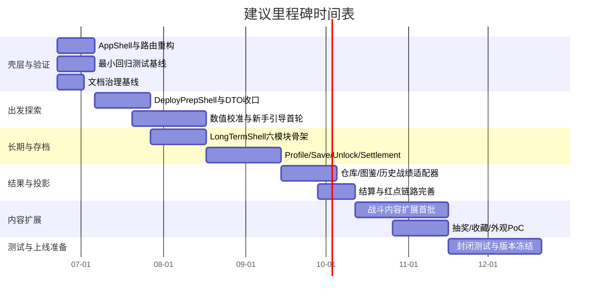
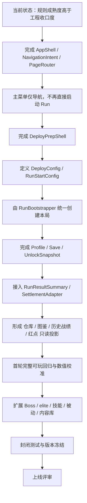

# 基于当前项目文件的游戏项目现状与下一阶段建议报告

## 执行摘要

项目已形成“扫雷式撤离探索 + 局内遭遇/战斗 + 局外长期成长”的规则骨架，且 G15/G16 局内基础可保留；但顶层导航、出发配置、存档写回与真实可玩验证尚未成型。下一阶段不应继续堆内容，而应先完成 AppShell/路由、DeployConfig、Profile/Save 与最小回归测试，再推进长期系统、仓库/图鉴/结算及后续内容扩展。 fileciteturn0file1 fileciteturn0file3 fileciteturn0file9

## 研究依据与假设

本报告以你当前提供的项目文件为第一依据，尤其以《文档索引与权威归属》《G16后工程架构评估与G17路线总结》《出发探索界面与出勤准备规则策划案》《长期系统整合与资产接口规则策划案》《物品资产模型与内容映射规则策划案》《本局结算报告与历史战绩系统》《难度判断》作为主要判断来源。索引文件已经明确：这些文档中有“当前权威候选”、也有“历史参考/待整合/部分被替代”的差异，因此本报告默认以“当前权威候选”与最新整合口径优先，历史文档只作冲突识别与风险参考。 fileciteturn0file0 fileciteturn0file1 fileciteturn0file3 fileciteturn0file6 fileciteturn0file9

你在提问中预设了“未提供：项目文件”，但本轮实际上已提供当前项目文件，因此本报告**不把“项目文件”视作缺失项**；不过，仍有若干关键材料未提供，会直接影响判断精度。 fileciteturn0file0

**未提供项与假设边界如下：**

- 未提供：团队规模/预算。因此下文所有工时均按**累计人时**估算，不代表自然日历时长，能否并行取决于团队人数。  
- 未提供：主菜单策划案正文。虽然索引把它列为“当前权威候选”，但正文未在本轮材料中出现，因此主菜单边界主要根据架构评估文档转述判断。 fileciteturn0file0 fileciteturn0file1
- 未提供：真实工程仓库运行日志、手动试玩记录、缺陷库、性能基准、崩溃统计。因此“可玩性/稳定性/性能”只能判断到“静态架构与规则合理性”，不能替代真实 QA 结论。架构评估文件也明确：G16 final 仅通过 Godot headless project-load/parser smoke，不能表述为完整 gameplay runtime PASS 或 manual playtest PASS。 fileciteturn0file1
- 未提供：独立仓库系统与资产视图规则策划案、舒适闭环原型 v1 范围策划案、统一术语表、变更日志、旧案归档说明、独立 UI 图片归属表；这些缺失项已被索引文件正式登记。 fileciteturn0file0
- 未提供：美术风格指南、资产清单、产能表、UI 最终稿规范。因此美术与 UI 一致性只能判断到“信息架构与参考图的存在”，不能判断到“量产规范已落地”。索引还明确指出 UI 图片是“参考资料”，不能反推规则。 fileciteturn0file0
- 未提供：联机/服务器/账号/匹配/后端方案文档。当前材料中可见的是本地 run、profile/save 占位与局外 snapshot/interfaces，因此多人/后端应视为**未进入当前主线范围**。 fileciteturn0file1
- 未提供：商业化奖池、定价、商城、活动、留存、买量与埋点方案。现阶段只能判断“商业化方向与边界”，不能判断“商业结果”。 fileciteturn0file9 fileciteturn0file6

## 项目现状概述

从当前文件组合来看，项目并不是“从零开始”，也不是“可上线内容后期”，而是一个**规则与信息架构相对完整、局内基础工程已存在、但局外骨架与验证链路尚未收口的中段原型项目**。换句话说，玩法定义已经比工程进度更成熟，项目的主要矛盾不是“还没想清楚做什么”，而是“已有方向正确，但顶层壳层、配置入口、存档写回和验证机制还没有闭环”。 fileciteturn0file1 fileciteturn0file0

### 分维度现状判断

| 维度 | 当前状态判断 | 结论 |
|---|---|---|
| 玩法 | 核心循环已经被数值文档明确为“进入未知房间→读雷数信息→判断候选格风险→积累收益与压力→寻找撤离点→选择撤离或继续探索”；战斗房也已被定义为搜打撤循环中的“打”，不是替代扫雷推理的主轴。 fileciteturn0file5 fileciteturn0file7 | **核心玩法方向清晰**，且差异点鲜明。 |
| 技术 | 架构评估认为 G15/G16 的局内 Encounter/Combat 基础可保留，但 `run_scene.gd` / `G9ShellPanel` 已承担过多顶层页面与启动职责，必须拆出 AppShell、NavigationIntent、PageRouter；同时 SaveAdapter 与 MetaProgressAdapter 仍是 contract-only / placeholder。 fileciteturn0file1 | **内核可留，壳层必须重构**。 |
| 艺术 | 索引中有主菜单、出发探索、长期系统“确定图/示例图/问题截图”归属，但明确规定 UI 图片只是参考，不可反推规则；出发探索文档已定义角色展示、背景切换、轻量视觉层级，但未见独立美术风格规范。 fileciteturn0file0 fileciteturn0file3 | **有视觉目标，但缺生产规范与一致性文档**。 |
| 关卡 | 难度文档已把 Demo 配置明确为 10×10、20 雷、10 事件、10 宝箱、10 怪物、2 个不可见撤离点、47 普通房，并给出不同地图尺寸与撤离点数量的梯度建议。 fileciteturn0file5 | **关卡数值模型已成形**，但工程级内容库与实际生成验证未提供。 |
| 数值 | 数值分析不只是拍脑袋，而是对撤离点分布、风险、踩雷率、尾部压力与曝光量做了系统建模，并强调真实平衡仍需用策略模拟与玩家日志校准。 fileciteturn0file5 fileciteturn0file4 | **理论基础扎实**，但**缺实测闭环**。 |
| UI/UX | 出发探索的信息架构已经很完整：五个一级页签、二级筛选、右侧摘要分页、主面板收起、背景切换、主操作入口与进行中探索切换规则都已成文；长期系统整合文档也把一级入口收束为六模块。 fileciteturn0file3 fileciteturn0file9 | **交互结构成熟**，但工程中仍有临时页与最终口径不一致。 |
| 多人/后端 | 已提供材料集中在单局 run、Deploy、LongTerm、Profile/Save 占位、SettlementAdapter 等本地或单机式边界，未见联机匹配、房间同步、服务端权威状态、账号体系等方案。 fileciteturn0file1 | **当前应按单人/本地产品路径推进**。 |
| 运营/商业化 | 长期系统已给出抽奖、收藏/外观、目标、图鉴、个人资历的结构边界；并明确抽奖与收藏并列、唯一仍是藏品、抽奖不应提供强数值成长，也不应成为主线必须。与此同时，架构评估明确要求抽奖/唯一不得早于真实 save/profile 骨架。 fileciteturn0file9 fileciteturn0file6 fileciteturn0file1 | **商业化方向有边界感**，但**产品化条件尚未具备**。 |
| 测试与质量 | 当前最硬的质量事实是：G16 已合入，但只经过 headless project-load/parser smoke；没有完整 gameplay runtime PASS，也没有 manual playtest PASS。另有多份规则文档自带“最低验收标准”，但尚未见实际回归体系。 fileciteturn0file1 fileciteturn0file3 fileciteturn0file2 fileciteturn0file6 fileciteturn0file9 | **文档验收标准不少，工程验证证据不足**。 |

### 综合判断

如果只看“方向”，项目是健康的：玩法闭环、资产边界、长期系统、结算通路、难度梯度都已经有相当完整的规则稿；如果只看“上线 readiness”，项目还很早：因为真正阻碍推进的不是缺一个新玩法，而是缺“正式导航壳 + 出发配置 DTO + 存档写回骨架 + 最小 QA 回归”。这也是为什么我会把项目定义为**设计成熟度高于工程收口度**。 fileciteturn0file1 fileciteturn0file3 fileciteturn0file6 fileciteturn0file9

## 已完成与未完成清单

### 已完成与部分完成项

下表区分“规则/文档完成”与“工程/实装完成”。这一步很重要，因为当前项目最容易出现的误判，就是把“规则层已经想清楚”误当成“工程层已经做完”。索引文件也明确禁止从 preview-only 页面、调试入口与临时实现反推正式规则。 fileciteturn0file0

| 模块 | 当前判定 | 说明 | 依据 |
|---|---|---|---|
| 文档治理索引 | 已完成 | 已形成权威候选、历史参考、缺失文档、UI 图片归属、待确认事项的总索引。 | fileciteturn0file0 |
| 核心玩法闭环 | 已完成（规则层） | “扫雷读数 + 撤离权发现 + 撤离/继续” 的主循环已成文，并有 Demo 难度定位。 | fileciteturn0file5 |
| G15/G16 局内 Encounter/Combat 基础 | 部分完成（工程层） | 可保留为局内基础；现状支持公共 encounter display/command contract、monster summary、risk/reward preview 和 attack_basic 桥接。 | fileciteturn0file1 |
| 出发探索 IA | 已完成（规则层） | 地图/仓库/申领/出勤配置/作业许可五页签、右侧摘要分页、背景切换、继续探索规则均已成文。 | fileciteturn0file3 |
| 长期系统 IA | 已完成（规则层） | 最新整合口径为六模块：目标、图鉴、研究、个人资历、抽奖、收藏/外观。 | fileciteturn0file9 fileciteturn0file0 |
| 物品资产模型 | 已完成（规则层） | 已区分通用资产、实体物品、外观解锁、记录解锁，并建立 Policy/Tag 与默认规则矩阵。 | fileciteturn0file6 |
| 结算报告与历史战绩边界 | 已完成（规则层） | 已明确“即时本局结果”与“长期快照”分离，并定义跳转、红点、排序筛选。 | fileciteturn0file2 |
| 难度分析方法 | 已完成（规则层） | 已给出当前 Demo 配置与完整游戏难度梯度建议，并强调要用真实玩家数据校准。 | fileciteturn0file5 |
| 长期系统旧七模块文档 | 历史参考 | 仍有参考价值，但已被新的六模块整合口径部分替代。 | fileciteturn0file0 fileciteturn0file8 |
| UI 目标图 | 部分完成 | 已有确定图/示例图/问题截图归属，但仅为参考，不是正式规则或量产标准。 | fileciteturn0file0 |

### 未完成、未落地或未提供项

| 模块 | 当前判定 | 关键问题 | 依据 |
|---|---|---|---|
| AppShell / NavigationIntent / PageRouter / MainMenuShell | 未完成 | 顶层导航仍未正式抽离，`run_scene.gd` / `G9ShellPanel` 继续承压会放大返工。 | fileciteturn0file1 |
| DeployPrepShell + DeployConfig / RunStartConfig | 未完成 | 出发探索最终入口尚未收束到正式 DTO 与 RunBootstrapper。 | fileciteturn0file1 fileciteturn0file3 |
| LongTermShell 正式入口 | 未完成 | 当前临时页模块不全，缺抽奖与收藏/外观的正式并列入口。 | fileciteturn0file1 fileciteturn0file9 |
| Profile / Meta / Save / UnlockSnapshot | 未完成 | 仍是 placeholder；`can_write_persistence()` 返回 false。 | fileciteturn0file1 |
| SettlementAdapter 真实写回 | 未完成 | 结算与长期资产写回路径还没形成真正安全链路。 | fileciteturn0file1 fileciteturn0file2 |
| 仓库系统与资产视图规则策划案 | 未提供 | 已被索引正式列为缺失待建文档。 | fileciteturn0file0 |
| 统一术语表 / 变更日志 / 旧案归档说明 | 未提供 | 会持续增加沟通与回归成本。 | fileciteturn0file0 |
| Boss / elite / 多怪 / 技能 / 被动 / 完整掉落经济 | 未完成（工程层） | 架构评估明确标注 G16 尚未实现。 | fileciteturn0file1 |
| 完整试玩验证 | 未完成 | 当前没有完整 gameplay runtime PASS，也没有 manual playtest PASS。 | fileciteturn0file1 |
| 多人/后端 | 未提供 | 当前材料中无联机/服务端方案，不建议误纳入现阶段关键路径。 | fileciteturn0file1 |
| 商业化奖池/价格/活动/留存方案 | 未提供 | 仅有方向边界，没有可执行经营方案。 | fileciteturn0file9 |

## 关键风险、阻碍与四项评分

### 关键风险与阻碍

当前最核心的阻碍不是“内容太少”，而是**系统边界没有在工程里收紧**。架构评估已经把最大返工风险说得很清楚：如果主菜单、Deploy、LongTerm、run start、profile/save 继续混在 `run_scene.gd`、`G9ShellPanel`、`CommandBus` 里，后面每做一个局外页面，都会进一步放大耦合与返工。 fileciteturn0file1

第二个阻碍是**长期数据写回尚未就位**。物品资产模型、长期系统整合、结算报告都已经假设存在一套稳定的奖励事件与结果快照机制，但工程侧 save/meta 仍是 placeholder。这意味着你现在其实已经拥有“设计层的长期成长系统”，但还没有“工程层的长期成长事实源”。如果直接做抽奖、唯一藏品或收藏展示，会先伤存档，再伤数据一致性。 fileciteturn0file6 fileciteturn0file9 fileciteturn0file1

第三个阻碍是**文档治理尚未收口**。索引文件正式记录了旧案、待整合项与缺失待建项，尤其是“仓库系统策划案缺失”“统一术语表缺失”“变更日志缺失”。这对中后期影响很大，因为仓库会同时服务 Deploy、结算、图鉴、收藏与研究，一旦没有统一术语和独立规则文档，改动会先在文档侧失真，再在工程侧扩散。 fileciteturn0file0 fileciteturn0file6

第四个阻碍是**玩法平衡尚未经过真实玩家校准**。难度文档把 “当前 Demo 是健康的标准偏难配置” 建立在模型推导之上，同时也明确说真实平衡必须通过策略模拟与玩家日志校准。换句话说，数值不是没有，而是还停留在“高质量理论阶段”，未进入“行为数据验证阶段”。 fileciteturn0file5

第五个阻碍是**UI 参考充足，但美术量产与一致性缺少规则化文件**。当前可以看出界面信息架构已经较成熟，但索引文件明确限制“图片只作参考，不反推规则”；同时没有独立风格指南、资产清单、节奏表与 UI 生产规范，这会让后续 UI 改版成本偏高。 fileciteturn0file0 fileciteturn0file3

### 四项评分

以下评分统一按 **5 分为最佳/最成熟/最健康，1 分为最弱/最不成熟/风险最高** 解释。

| 评估项 | 评分 | 评分依据 |
|---|---:|---|
| 玩法可玩性 | **3/5** | 玩法主循环、撤离权模型、战斗房定位、出发探索与结算边界都已比较清晰，说明“玩什么”和“为何好玩”基本成立；但还缺完整 runtime 与人工试玩验证，因此目前最多可判为“高潜力、未验真”。 fileciteturn0file5 fileciteturn0file7 fileciteturn0file1 |
| 技术债务 | **2/5** | 局内基础可保留是好消息，但顶层壳层耦合、启动流程未收口、save/meta 占位、局外/局内边界有继续污染风险，是实打实的结构性债务。 fileciteturn0file1 |
| 艺术风格一致性 | **2/5** | 已有主菜单/出发探索/长期系统目标图和明确的信息架构，但图片只被定义为参考资料，且缺少独立风格指南、UI 图片归属专文与量产规范，所以“方向有了，一致性体系还没建好”。 fileciteturn0file0 fileciteturn0file3 |
| 商业化可行性 | **2/5** | 长期系统对抽奖、收藏、外观给出了正确边界：非强数值、非主线必须、与仓库/图鉴/收藏分层；但真实 save/profile、奖池、价格、活动和结果写回均未落地，现阶段还不具备上线型商业化条件。 fileciteturn0file9 fileciteturn0file6 fileciteturn0file1 |

## 下一阶段优先任务与里程碑

### 任务排序原则

我建议把接下来 3–6 个月的工作定义为：**先收壳层，再收配置与写回，再做只读投影，最后扩内容与商业化 PoC**。这与当前文件给出的最佳路线是一致的：G17 先做 AppShell/路由/主菜单壳，G18 做出发探索与 DeployConfig，G20 再补 Profile/Save/Unlock/Settlement。 fileciteturn0file1

由于**未提供：团队规模/预算**，下表工时均使用“累计人时”而非自然工期；如果团队只有 2–3 人，则表中很多任务不能并行，自然时长会明显拉长。

### 优先级任务清单

| 阶段 | 优先级 | 任务 | 预估工时 | 所需角色与技能 | 依赖关系 | 验收标准 | 可交付物 |
|---|---|---|---:|---|---|---|---|
| 短期 2 周 | P0 | **顶层应用壳重构**：AppShell + NavigationIntent + PageRouter + MainMenuShell | 120–180h | 技术负责人、Godot 工程师、UI 工程师、系统策划 | 无 | 主菜单只有固定入口；按钮只发导航；不直接 start/continue run；退出确认存在；页面切换从 `run_scene.gd` 抽离。 fileciteturn0file1 | AppShell 场景、导航协议文档、MainMenuShell、重构说明 |
| 短期 2 周 | P0 | **最小可玩回归基线**：runtime smoke + manual checklist + bug triage | 60–100h | QA、Godot 工程师、制作人 | 与壳层重构并行 | 补齐基础运行冒烟、手动回归清单、缺陷分级；至少覆盖主菜单、run 进入、页面切换、退出流程。依据是当前只有 headless/parser smoke。 fileciteturn0file1 | QA checklist v0.1、缺陷清单、冒烟测试脚本/记录 |
| 短期 2 周 | P1 | **文档治理基线**：术语表、缺失文档排期、权威关系冻结 | 32–56h | 系统策划、制作人 | 无 | 明确当前权威候选、历史参考、缺失项优先级；形成统一术语表 v0.1 和文档头字段模板。 fileciteturn0file0 | 术语表 v0.1、文档状态模板、缺失文档 backlog |
| 中期 1–3 个月 | P0 | **DeployPrepShell + DeployConfig + RunBootstrapper 收口** | 180–280h | Gameplay 工程师、UI 工程师、系统策划 | 顶层应用壳 | 地图/仓库/申领/出勤配置/作业许可五页签可进入；右侧摘要可分页；开始/继续/放弃都归入 Deploy；RunBootstrapper 只接受 DeployConfig；不提前生成真实地图。 fileciteturn0file3 fileciteturn0file1 | DeployPrepShell、DeployConfig DTO、RunBootstrapper、交互原型 |
| 中期 1–3 个月 | P1 | **LongTermShell 六模块只读骨架** | 120–180h | UI 工程师、系统策划、UI/UX 设计 | 顶层应用壳 | 目标/图鉴/研究/个人资历/抽奖/收藏外观六模块并列可进；可跳转 Deploy；不直接改本局状态。 fileciteturn0file9 | LongTermShell、模块入口占位页、跳转协议 |
| 中期 1–3 个月 | P0 | **Profile / Save / UnlockSnapshot / RunResultSummary / SettlementAdapter 骨架** | 180–260h | 架构工程师、数据/存档工程师、QA | DeployConfig 基本稳定 | 长期获得内容具备安全写入路径；UI 先写存档再展示；Deploy 从 UnlockSnapshot 读可用项；RunResultSummary 可进入 SettlementAdapter。 fileciteturn0file1 | Profile 模型、Save skeleton、UnlockSnapshot、SettlementAdapter v0.1 |
| 中期 1–3 个月 | P1 | **仓库/图鉴/历史战绩只读投影与红点系统** | 140–220h | 工程师、系统策划、UI 工程师 | Save/Profile 骨架 | 同一底层数据可分别投影到 Deploy 仓库视角、LongTerm 图鉴/个人资历和结算新增提示；历史战绩支持基础排序筛选；红点统一、克制、可清除。 fileciteturn0file2 fileciteturn0file6 fileciteturn0file9 | Warehouse Adapter、Codex Adapter、History Page、红点规则配置 |
| 中期 1–3 个月 | P1 | **数值校准与新手引导最小化** | 100–160h | 数值策划、UX、QA、数据分析 | Deploy 可玩、基础日志可记录 | 验证 10×10/2 撤离点 Demo 的真实表现；采集找出口时间、踩雷率、失败原因；必要时补标记、提示、起点保护或引导，而不是先改大盘数值。 fileciteturn0file5 fileciteturn0file4 | Playtest 报告、参数调整单、新手引导草案 |
| 长期 3–6 个月 | P1 | **战斗内容扩展包**：elite/Boss/技能/被动/事件库首批可玩集 | 240–400h | 战斗设计、Gameplay 工程、美术/VFX、UI、QA | Save/Deploy 基线稳定 | 普通战斗房、Boss 房、技能预警、被动可读性、动态战斗力反馈形成首批可玩闭环；Boss 保持可选挑战，不阻断普通撤离。 fileciteturn0file7 fileciteturn0file1 | 怪物模板包、Boss 原型、战斗日志/结算接入 |
| 长期 3–6 个月 | P2 | **抽奖/收藏/外观 PoC** | 120–200h | 经济策划、UI 工程、存档工程、UI 美术 | Save/Profile/Collection Adapter | 结果先写存档再展示；唯一仍归类为藏品；抽奖不提供强数值成长；不做主菜单大入口。 fileciteturn0file9 fileciteturn0file6 fileciteturn0file1 | 抽奖结果页 PoC、收藏展示页、唯一获得演出原型 |
| 长期 3–6 个月 | P0 | **封闭测试与上线准备** | 160–260h | QA 负责人、制作人、工程师、系统策划 | 前述关键链路完工 | 至少形成版本冻结、缺陷烧尽、平衡复盘、关键路径手册；若继续保持单人产品路径，则此阶段不引入多人/后端大改。 | Alpha/Beta 测试报告、版本清单、上线阻塞项列表 |

### 建议里程碑时间表

下面给出一个**假设于 2026 年 6 月 22 日启动**的建议时间表。由于**未提供：团队规模/预算**，这是一份“优先级驱动”的建议节奏，不是承诺工期。

| 建议节点 | 日期建议 | 里程碑目标 |
|---|---|---|
| M1 | 2026-07-05 | 完成 AppShell/路由/主菜单壳，停止向 `run_scene.gd` 继续堆顶层业务。 |
| M2 | 2026-08-16 | 出发探索竖切完成：DeployPrepShell、DeployConfig、RunBootstrapper 收口，可从主菜单进入并开始/继续探索。 |
| M3 | 2026-09-13 | 长期系统六模块入口与 Save/Profile/UnlockSnapshot 初版完成，形成可持续写回骨架。 |
| M4 | 2026-10-11 | 仓库/图鉴/历史战绩/结算只读投影与红点链路完成，局内→局外结果可追踪。 |
| M5 | 2026-11-15 | 首批内容扩展与平衡校准完成，进入封闭测试；如做抽奖/收藏，仅允许在 Save 骨架之后接入。 |
| M6 | 2026-12-20 | 完成一次内容冻结与上线评审：决定进入外测/商店页准备，或继续内容补强。 |

### 建议里程碑甘特图

### 从当前状态到上线的关键路径

## 竞品对比与可借鉴点

严格意义上，当前项目的“扫雷读数 + 撤离权解锁 + 轻/中度战斗房 + 局外长期成长”是相对少见的混合形态，因此很难找到**完全同构**竞品。更合理的做法，是分别从“搜打撤风险循环”“单人撤离原型”“房间战斗表达”“商业化边界”四个方向去借鉴。下表选择了 4 个最有参考价值的国内外样本。官方文本若抓取不可得，则退而引用 Steam 商店页或权威媒体。 citeturn4view1turn4view0turn9search0turn10search0

| 游戏 | 核心玩法对照 | 商业模式 | 可借鉴点 | 不宜直接照搬 |
|---|---|---|---|---|
| **ZERO Sievert** | 顶视角、单人、程序化地图、搜集—撤离—基地成长循环非常接近当前项目的“单人撤离式原型”；Steam 页强调“top-down extraction shooter”“基地提供 trader/modding/base progression”，并写到“get back alive”“procedurally generated maps”。 citeturn4view1 | 付费买断，后续内容更新。Steam 页给出直接购买与价格信息。 citeturn4view1 | 最值得借鉴的是：**单人搜打撤也能成立**，关键在于基地成长、任务线、地图程序化和进出节奏；这对你当前“不做多人/后端”的阶段尤其重要。 citeturn4view1 | 它更偏射击与装备改造，当前项目的差异化优势在“扫雷读数推理”，不能被纯枪械成长稀释。 |
| **Escape from Tarkov** | 其核心是高风险 raid、携装入局、撤离成功带出、失败高损失；这些是搜打撤类型最经典的风险资产模型。权威资料也指出玩家以“raids”为单位搜刮并寻找 extraction。 citeturn10search0turn10search5 | 传统买断，多版本售卖；权威资料提到 1.0 发布后仍保留多版本销售。 citeturn10search0 | 用于借鉴**失败痛感、风险资产、撤离点目标感**，以及为什么搜打撤需要“出发配置—局内取舍—撤离结算”三段式闭环。 | 其重度拟真、多人对抗和高认知负担，不适合作为当前项目前 6 个月的直接目标。 |
| **Arena Breakout / 暗区突围** | 与 Tarkov 类似，也是入局带装、地图搜刮、到达撤离点带出战利品；权威资料还提到其在开局装备准备、地图难度区分和提取点设计上的完整化。 citeturn9search0turn9search1 | 免费游玩为主，但多家媒体批评其付费模式带来公平性争议。 citeturn9search0turn11search1 | 最值得借鉴的是**新手引导与易用性包装**：在保持高风险循环的同时，把“入局前准备”做得更可理解。 | 不建议照搬其付费强度路径。当前项目文件已明确抽奖/外观不应给强数值成长，也不应成为主线必须。 fileciteturn0file9 |
| **The Binding of Isaac: Rebirth** | Steam 页明确写到它是“randomly generated action RPG shooter with heavy Rogue-like elements”，核心是房间推进、道具驱动构筑、Boss 与高重复性 runs；这与当前战斗房/Boss 房/长期内容扩展有很强的方法论相似性。 citeturn4view0 | 买断 + DLC 扩展，Steam 页直接列出本体、bundle 与 DLC。 citeturn4view0 | 可借鉴的是**房间战斗的阅读性、build 驱动体验、长尾内容组织**，尤其适合你后续战斗房、Boss 房与图鉴/收藏增长。 | 不能把当前项目做成“纯房间战斗 roguelite”；现有文件已反复强调战斗房不能取代扫雷推理与撤离主轴。 fileciteturn0file7 |

### 竞品结论

如果用一句话概括竞品启示，我会这样写：**当前项目最该学 ZERO Sievert 的“单人撤离闭环”、学 Tarkov/暗区的“风险资产与出发准备”、学 Isaac 的“房间战斗可读性与 build 演出”，但不该学高复杂多人、重度拟真与强付费争议。**这正好与项目文件中的边界相吻合：先把单人搜打撤原型做深，再把长期系统、收藏展示和内容扩展按顺序接上。 citeturn4view1turn10search0turn9search1turn4view0 fileciteturn0file1 fileciteturn0file9

## 结论

当前项目最强的部分，是**规则层**：玩法主循环、出发探索、长期系统、资产模型、结算与战绩、难度分析几乎已经把“产品应该长成什么样”写清楚了。当前项目最弱的部分，是**工程收口与验证层**：顶层导航壳尚未正式拆分、出发配置尚未收口为 DTO、长期写回仍是 placeholder、真实可玩与质量证据不足。 fileciteturn0file1 fileciteturn0file3 fileciteturn0file6 fileciteturn0file9

因此，下一阶段最正确的动作不是“马上多做地图、多做 UI、多做抽奖、多做 Boss”，而是先完成四件事：**壳层重构、出发配置收口、存档写回骨架、最小回归验证**。只要这四件事做对了，后续长期系统、结算/战绩、仓库/图鉴投影、内容扩展与商业化 PoC 都能沿着当前文档边界顺滑推进；反过来，如果这四件事不做，项目会不断在临时 shell、临时 page、临时入口和临时写回之间返工。 fileciteturn0file1

从“当前项目文件”出发，我对项目现状的总判断是：**这是一个值得继续推进、但必须先补骨架再长内容的中段原型项目。**